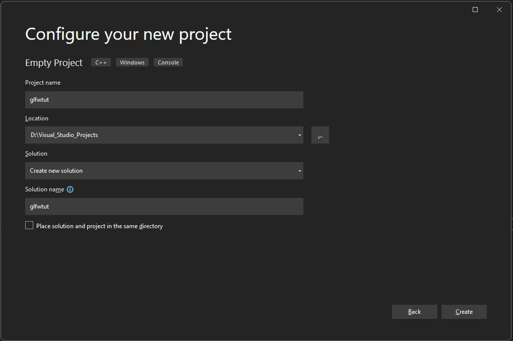
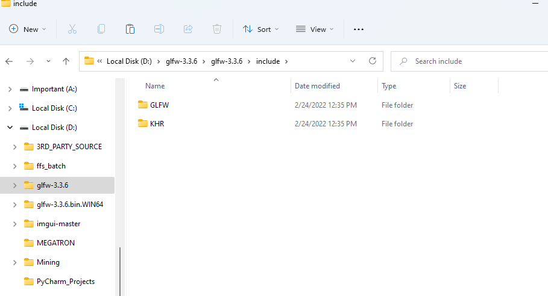
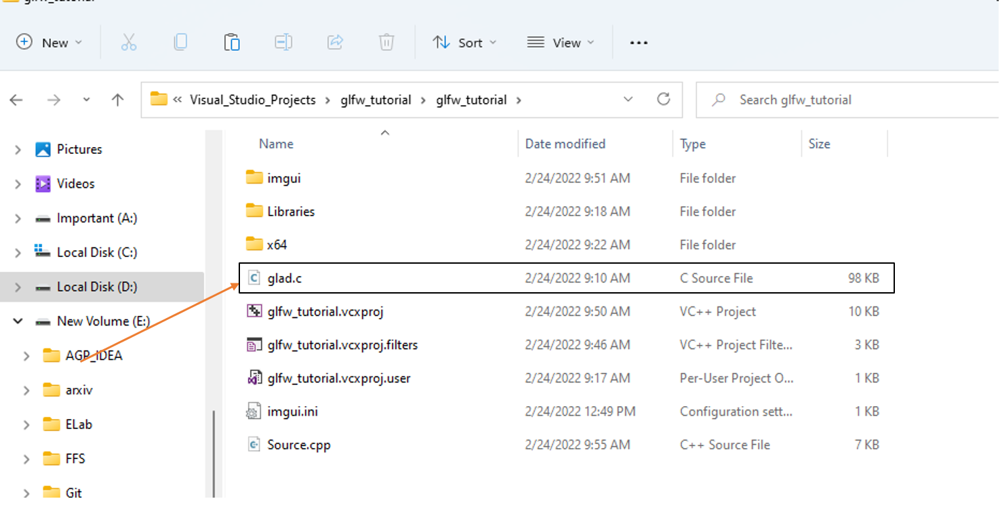
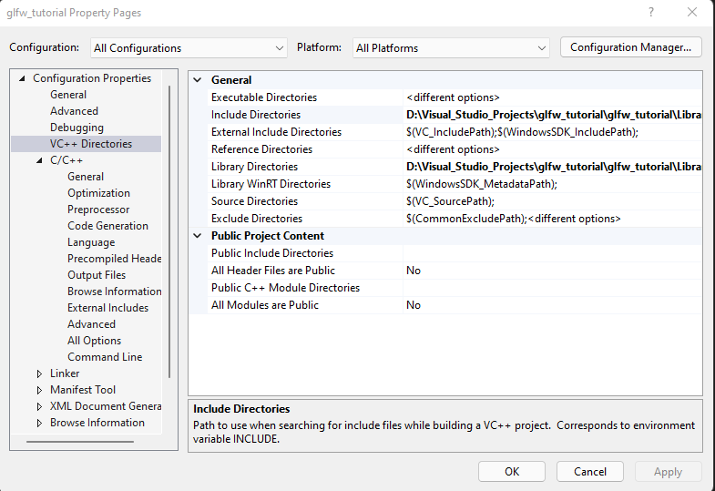

# ΑΡΧΕΣ ΓΛΩΣΣΩΝ ΠΡΟΓΡΑΜΜΑΤΙΣΜΟΥ

# ΕΓΚΑΤΑΣΤΑΣΕΙΣ

  **DirectX**

  1. Εγκαταστήστε στον υπολογιστή σας το ακόλουθο πακέτο:[https://www.microsoft.com/en-US/download/confirmation.aspx?id=35](https://www.microsoft.com/en-US/download/confirmation.aspx?id=35)

  ```
   Τι είναι το DirectX:
   Το DirectX είναι ένα σύνολο από στοιχεία των Windows που επιτρέπει κυρίως λογισμικού, και ειδικά τα παιχνίδια, για να εργαστείτε απευθείας με το υλικό σας βίντεο και ήχου.  Παιχνίδια που χρησιμοποιούν το DirectX να χρησιμοποιήσετε δυνατότητες επιταχυντής πολυμέσων που είναι ενσωματωμένα στο υλικό σας περισσότερες αποτελεσματικά που βελτιώνει την εμπειρία πολυμέσων συνολικά
  ```
  **GLFW Library**

  1. Λήψη του πακέτου GLFW:[https://sourceforge.net/projects/glfw/files/glfw/3.0.4/glfw-3.0.4.bin.WIN32.zip/download](https://sourceforge.net/projects/glfw/files/glfw/3.0.4/glfw-3.0.4.bin.WIN32.zip/download)

  **Vulkan API**

  1. Λήψη vulkan SDK για windows:[https://sdk.lunarg.com/sdk/download/1.3.204.0/windows/VulkanSDK-1.3.204.0-Installer.exe](https://sdk.lunarg.com/sdk/download/1.3.204.0/windows/VulkanSDK-1.3.204.0-Installer.exe)

  ### Integration ανάμεσα στην βιβλιοθήκη glfw και στην βιβλιοθήκη DearImGui με χρήση του visual studio 2022.

  1. Δημιουργία κενού project στο visual studio.
  

  2. Δημιουργία φακέλου Libraries και υποφακέλων include και lib στον φάκελο του project.
  
  3. Αντιγραφή  του φακέλου <glfw_source>/include/GLFW στον φάκελο include που δημιουργήσαμε παραπάνω.
    

  4. Αντιγραφή του αρχείου glad.c στον κύριο φάκελο του project 
  
  
  5. Στο Μενού properties επιλέγω Configuration_Properties/VC++ Directories/Include Directories και προσθέτω την παρακάτω επιλογή 
  ```
      $(SolutionDir)<project_name>\Libraries\include
  ```

  

  6. Στο μενού properties επιλέγω Configuration_Properties/VC++ Directories/Library Directories και προσθέτω την παρακάτω επιλογή
   
   ```
      $(SolutionDir)<project_name>\Libraries\lib
   ```

  7. Δημιουργία filter στον φάκελο source_files και προσθήκη όλων των αρχείων .cpp που εισήχθηκαν από την βιβλιοθήκη ImGui. Αντίστοιχη διαδικασία θα πραγματοποιηθεί και για τα header files που χρησιμοποιήθηκαν από την βιβλιοθήκη imgui.


## Visual Studio Projects

* Tutorial Project 1:[glfw_tutorial_project_1.zip](glfw_tutorial_project_1.zip)